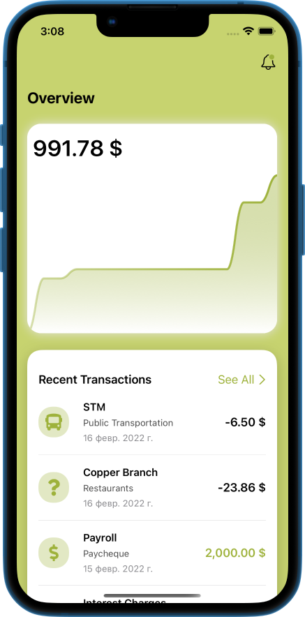
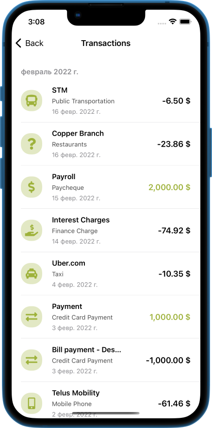

# iExpense-SwiftUI app
I created iExpense-SwiftUI. A chart showing the current spending for this month may be found in the main view. 

The most recent five transactions are shown in the section below. Every transaction includes information on the merchant, category, date, and sum. If it is a debit, the amount is negative; if it is a credit, it is positive and colored. We can see the icon connected to the category on the left.

These icons are loaded from the SwiftUIFontIcon third-party library and mapped across each category. The screen that displays all transactions is organized by month if you click the See All link. Additionally, this app has a stunning dark mode. This app is data-focused, so beware. Since it is a financial software, computations and other logics will be used to resolve the correct data.

   
   

